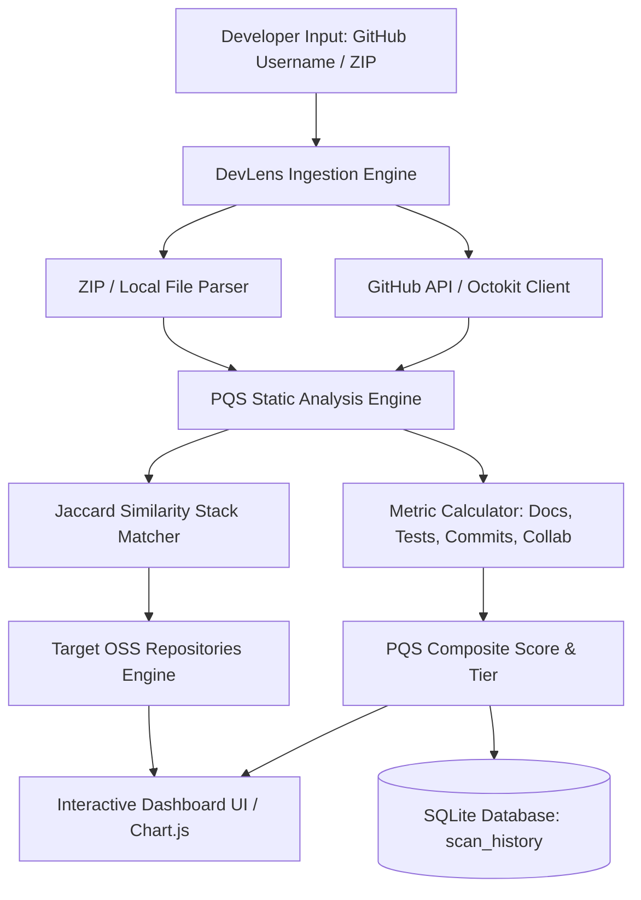

# 🔍 DevLens AI — Automated Developer Portfolio Evaluation & Open-Source Readiness

<div align="center">


**DevLens AI** is an intelligent developer portfolio assessment and skill-gap recommendation engine designed to quantify codebase quality, evaluate open-source readiness, and bridge the gap between aspiring developers and real-world engineering standards.

[Key Features](#-key-features) • [Architecture](#-architecture) • [Scoring Engine](#-portfolio-quality-score-pqs-methodology) • [Getting Started](#-getting-started) • [API Reference](#-api-reference)

</div>

---

## 📌 Problem Statement

Traditional developer evaluation relies heavily on vanity metrics (such as GitHub contribution green squares, raw commit counts, or follower counts) which fail to measure genuine engineering rigor:
- **Lack of Code Quality Metrics:** High commit counts often hide missing tests, poor documentation, and unmaintainable architectures.
- **Open-Source Contribution Barrier:** Junior developers struggle to identify open-source repositories matching their specific technical stack and skill level.
- **Subjective Portfolio Reviews:** Manual portfolio evaluations are inconsistent, slow, and non-actionable.

**DevLens AI** solves this by performing deep heuristic static analysis, computing an objective **Portfolio Quality Score (PQS)**, and providing personalized open-source repository recommendations using **Jaccard Similarity Matching**.

---

## 🚀 Key Features

- 📊 **Multi-Dimensional Portfolio Quality Score (PQS):** Weighted algorithmic scoring across Documentation, Testing & Quality, Commit Rigor, and Community/Collaboration.
- 🎯 **Open-Source Readiness & Jaccard Matcher:** Matches developer technology vectors against curated open-source repositories (React, Django, Rust, Go, Vue, Flask, Rails, etc.) to recommend tailored contribution targets.
- 📂 **Dual Ingestion Engine:**
  - **Live GitHub API Analysis:** Scans public user repositories via Octokit with intelligent fallback and rate-limit handling.
  - **Local Repository / ZIP Upload:** Direct client-side and server-side archive inspection for private projects and offline environments.
- 📈 **Interactive Visual Analytics:**
  - Radial score indicators and dynamic radar/bar charts powered by Chart.js.
  - Granular breakdown cards with actionable diagnostic tips.
- 🗄️ **Persistent History & Trend Tracking:** Embedded SQLite database to track portfolio progression across multiple scans over time.
- 🛡️ **Customizable Evaluation Thresholds:** Interactive UI sliders allowing recruiters and developers to tune metric weights and evaluation strictness dynamically.

---

## 📐 Architecture & Tech Stack



### Technology Stack

| Layer | Technologies |
|---|---|
| **Frontend** | Vanilla HTML5, Modern CSS (Glassmorphism & GitHub Dark Theme), Vanilla JavaScript, Chart.js |
| **Backend** | Node.js, Express.js (v5), CORS, Dotenv |
| **Data & Persistence** | SQLite3 (`data/devlens.db`) |
| **GitHub Integration** | `@octokit/rest`, GitHub REST API v3 |
| **Algorithms** | Static AST/File Heuristics, Multi-Metric Weighted Scoring, Jaccard Similarity Index |

---

## 🧮 Portfolio Quality Score (PQS) Methodology

The composite **Portfolio Quality Score (0–100)** is computed as a weighted sum of four core dimensions:

$$\text{PQS} = w_1 \cdot \text{DocScore} + w_2 \cdot \text{TestScore} + w_3 \cdot \text{CommitScore} + w_4 \cdot \text{CollabScore}$$

### Scoring Dimensions

| Dimension | Default Weight | Key Evaluation Metrics |
|---|:---:|---|
| **Documentation Score** | 25% | Presence and depth of `README.md`, architectural diagrams, inline comments, docstrings, licensing (`LICENSE`), and API specifications. |
| **Testing & Quality Score** | 35% | Presence of test suites (`tests/`, `__tests__`, `.spec.js`, `test_*.py`), test coverage indicators, CI/CD workflows (`.github/workflows`), and linter configs (`.eslintrc`, `.prettierrc`). |
| **Commit Rigor & Hygiene** | 20% | Conventional commit conventions, branch hygiene, commit message length, atomicity, and consistent commit cadence. |
| **Collaboration & Community** | 20% | Issues handling, PR templates (`PULL_REQUEST_TEMPLATE.md`), contributing guidelines (`CONTRIBUTING.md`), issue templates, and code review activity. |

### Skill Tier Classification

- 🏆 **Tier S (90–100):** Production & Enterprise Ready — Exemplary standards across all dimensions.
- 🥇 **Tier A (75–89):** Open-Source Contributor — Strong fundamentals, solid test coverage, and documentation.
- 🥈 **Tier B (60–74):** Competent Developer — Good project structure with minor gaps in testing or CI/CD.
- 🥉 **Tier C (<60):** Emerging Developer — Actionable improvement needed in documentation, testing rigor, or commit hygiene.

---

## 📁 Repository Structure

```text
devlens-ai/
├── data/
│   └── devlens.db                                  # SQLite persistent database
├── DevLens_AI_Capstone_Phase_1_Report_19Pages.docx # Comprehensive capstone project report (Word)
├── DevLens_AI_Capstone_Phase_1_Report_19Pages.tex  # Capstone report source (LaTeX)
├── index.html                                      # Main dashboard & interactive UI
├── index.css                                       # Dark-mode design system & styling
├── server.js                                       # Express backend & SQLite REST API
├── package.json                                    # Project dependencies and metadata
└── README.md                                       # Project documentation
```

---

## ⚡ Getting Started

### Prerequisites

- [Node.js](https://nodejs.org/) (version 18.x or higher)
- [npm](https://www.npmjs.com/) (version 9.x or higher)
- Optional: GitHub Personal Access Token (for extended API rate limits)

### Installation

1. **Clone the repository:**
   ```bash
   git clone https://github.com/aditilande08/devlens-ai.git
   cd devlens-ai
   ```

2. **Install dependencies:**
   ```bash
   npm install
   ```

3. **Configure Environment Variables (Optional):**
   Create a `.env` file in the root directory:
   ```env
   PORT=5000
   GITHUB_TOKEN=your_personal_access_token_here
   ```

4. **Start the server:**
   ```bash
   node server.js
   ```
   *Or for development with automatic reload:*
   ```bash
   npx nodemon server.js
   ```

5. **Launch DevLens AI:**
   Open your browser and navigate to:
   ```
   http://localhost:5000
   ```

---

## 🔌 API Reference

### 1. Save Scan Result
- **Endpoint:** `POST /api/scan`
- **Payload:**
  ```json
  {
    "username": "aditilande08",
    "pqs_score": 85,
    "doc_score": 90,
    "test_score": 80,
    "commit_score": 85,
    "collab_score": 85,
    "repos_scanned": 12,
    "languages": ["JavaScript", "Python", "HTML", "CSS"],
    "tier": "Tier A"
  }
  ```
- **Response:** `200 OK` `{ "id": 1, "message": "Scan saved" }`

### 2. Get Scan History
- **Endpoint:** `GET /api/history`
- **Query Params:** `?username=aditilande08` (optional)
- **Response:** Array of historical scan objects sorted by `scanned_at DESC`.

### 3. Get Target Open-Source Repositories
- **Endpoint:** `GET /api/repositories`
- **Response:** List of curated open-source repositories with tech stacks, difficulty levels, and star counts.

### 4. System Analytics Summary
- **Endpoint:** `GET /api/stats`
- **Response:**
  ```json
  {
    "total_scans": 42,
    "unique_users": 18,
    "avg_pqs": 78.4
  }
  ```

---

## 👥 Authors & Capstone Project

- **Aditi Lande** ([@aditilande08](https://github.com/aditilande08))
- Project: **DevLens AI — Automated Developer Portfolio Evaluation & Open-Source Readiness**
- Capstone Phase 1 Documentation included in `.docx` and `.tex` formats.

---

## 📄 License

This project is licensed under the [ISC License](LICENSE).
